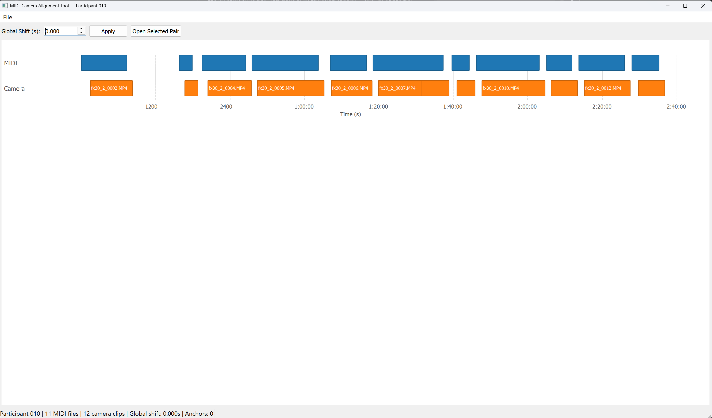

# Level 1 — Timeline overview

Level 1 is a Gantt-style bar chart of every clip in the session on a shared time axis. It exists to give a one-glance sense of which MIDI files and camera clips were recorded when, and to provide the coarse-alignment control (the participant's global shift).



```
┌──────────────────────────────────────────────────────────────────┐
│ Global Shift (s): [ 0.000 ▲▼ ]  [ Apply ]  [ Open Selected Pair ]│
├──────────────────────────────────────────────────────────────────┤
│                                                                  │
│  MIDI      █████   ███████   ████       █████                    │
│                                                                  │
│  Camera         █████   ███████   ████       █████               │
│                                                                  │
│           0s    100s    200s    300s    400s    500s   Time (s)  │
└──────────────────────────────────────────────────────────────────┘
```

Blue bars are MIDI clips (top row). Orange bars are camera clips (bottom row). Each bar's length is proportional to the clip's `duration`. Filenames are printed inside each bar when there's room.

## Global Shift controls (top row)

| Widget | Behaviour |
|---|---|
| **Global Shift (s)** `QDoubleSpinBox` | Range `±100000 s`, **3 decimal places**, single-step `0.1`. Initial value is `state.global_shift_seconds`. Editing the value does *not* change state — you must click **Apply**. |
| **Apply** `QPushButton` | Calls `AlignmentService.set_global_shift(value, clear_anchors_if_needed=False)`. If anchors exist, shows a `Yes/No` confirmation dialog ("*N anchor(s) exist. Applying a new global shift will clear all anchors across all clips. Continue?*"); on **No**, the spinbox is reverted to the current state value. On **Yes**, re-calls with `clear_anchors_if_needed=True`. On success, the canvas re-renders and `state_modified` is emitted (marks window dirty). |
| **Open Selected Pair** `QPushButton` | If both a MIDI bar and a camera bar are selected, emits `pair_selected` to drill into Level 2. Equivalent to double-clicking. |

## Canvas interactions

| Input | Action |
|---|---|
| **Left-click a blue (MIDI) bar** | Toggle-select it. Clicking it again or clicking a different MIDI bar changes the selection. |
| **Left-click an orange (camera) bar** | Same, for the camera side. |
| **Left-click empty space + drag** | Pan the time view horizontally. |
| **Hover over a bar** | Tooltip with filename, duration, and unix start/end (plus capture FPS for camera). |
| **Double-click anywhere** (when both rows have a selection) | Emits `pair_selected(midi_index, camera_index)` → Level 2. |
| **Mouse wheel** | Zoom in (wheel up, factor `0.8`) or out (wheel down, factor `1.25`), centered on the cursor. |

Selection visual: a 2 px yellow border is drawn around the selected bar. Selection persists across panning and zooming; it is cleared only by clicking the same bar again or loading a new session.

## Zoom limits

- Minimum viewport: **1 second** — prevents accidental infinite-zoom.
- Maximum viewport: **100 000 seconds** (~27 h).

If a zoom would exceed either limit the wheel event is silently ignored.

## Grid

The background shows dashed vertical grid lines at "nice" intervals chosen from `[1, 2, 5, 10, 20, 30, 60, 120, 300, 600, 1200, 1800, 3600]` seconds, targeting about 10 ticks across the viewport. Tick labels use `MM:SS` or `H:MM:SS` above 1 h, plain seconds below.

## What the bars reflect

- **MIDI bars** are drawn using `unix_start` and `unix_end` straight from `MidiFileInfo`.
- **Camera bars** are drawn using `raw_unix_start + effective_shift_for_camera(...)` — the clip's wall-clock start with the current global shift (and any active anchor) applied. Changing the global shift immediately re-renders the camera row at its new alignment; MIDI bars stay put.

The tooltip on a camera bar distinguishes:

```
C0001.MP4
Duration: 450.1s
Raw start: 1707345678.9       ← from mtime, unshifted
Aligned start: 1707345740.2   ← after effective_shift
Capture FPS: 239.76
```

## Returning from Level 2

Coming back from Level 2 (via **Back**, ++esc++, or **Compute Global Shift** finishing) refreshes the canvas in place. Selections survive the round trip. The spinbox value is re-synced to `state.global_shift_seconds` in case it was changed in Level 2.
